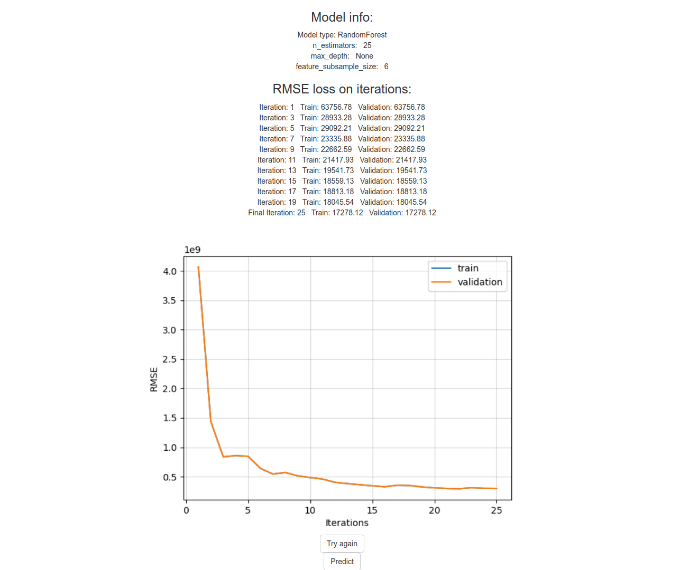

# Ensembles
Contains implementation of Random Forest, Gradient Boosting algorithms. Also contains a local web server to use these algorithms.

### Installation and starting
1. Clone repository
2. Put Dockerfile and files from `scripts` into the `server` folder
3. Build docker image:
   ```bash
   sudo bash ./build.sh
   ```
2. Run server:
   ```bash
   sudo bash ./run.sh
   ```

### Usage
1. Type "0.0.0.0:5000" in the search bar in your browser. 
2. Choose model to train.


3. Fill parameters, also you can set default parameters by clicking `Fill default parameters`.


4. Upload csv train and (optional) validation datasets. Each dataset must have at least 1 numeric column and 1 column with target.
5. Specify the target column name.


6. Train model
7. After training you will see results. You can train your model again or you can create a submission on a new (or old) csv file with the same columns (except target).



8. Upload csv file and download submission.csv as a prediction


Link to dockerhub repository: https://hub.docker.com/repository/docker/makriot/ensembles_web_server
